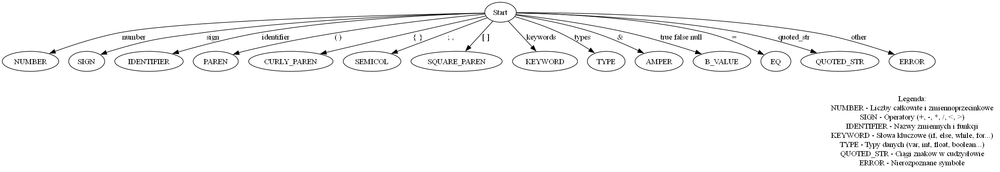

# kompilatory_repo

[demo](https://mikkdud.github.io/kompilatory_repo/)

## Spis tokenów rozpoznawanych przez program.

| Token | Wartość |
| ----- | ----- |
| TT\_INT | liczba całkowita |
| TT\_FLOAT | liczba zmiennoprzecinkowa |
| TT\_PLUS | ‘+’ |
| TT\_MINUS | ‘-’ |
| TT\_MUL | ‘\*’ |
| TT\_DIV | ‘/’ |
| TT\_LPAREN | ‘(‘ |
| TT\_RPAREN | ‘)’ |
| TT\_WHITE | ‘\\n’, ‘ ‘, ‘\\t’ |
| TT\_LESS | ‘\<’ |
| TT\_GREATER | ‘\>’ |
| TT\_L\_CURLY | ‘{‘ |
| TT\_R\_CURLY | ‘}’ |
| TT\_SEMICOLON | ‘;’ |
| TT\_L\_SQUARE | ‘\[‘ |
| TT\_R\_SQUARE | ‘\]’ |
| TT\_AMPERSAND | ‘&’ |
| TT\_IDENTIFIER | łańcuch znaków nie będący słowem kluczowym |
| TT\_KEYWORD | ‘if’, ‘else’, ‘for’, ‘while’, ‘break’, ‘continue’, ‘return’, ‘def’ |
| TT\_TYPE | ‘var’, ‘string’, ‘int’, ‘float’, ‘double’, ‘boolean’, ‘char’, ‘long’ |
| TT\_VAL | ‘true’, ‘false’, ‘null’ |
| TT\_EQ | ‘=’ |
| TT\_QUOTED\_STRING | łańcuch znaków w cudzysłowie, np: “hello” |
| TT\_COMMA | ‘,’ |

## Jak uruchomić?
1. Sklonuj repozytorium
2. Przejdź do folderu projektu 
3. Stwórz wirtualne środowisko:
   - `python -m venv venv`
4. Aktywuj je:
   - open terminal (e. g. git bash) and write `source venv/Scripts/activate` (on Windows) or `source venv/bin/activate` (on Linux/macOS)
5. Teraz powinno pojawić się "(venv)" w twoim terminalu.
6. Przejdź do skaner/python: `cd skaner/python`
7. Użyj komendy `python __main__.py input.txt`
8. Aby dezaktywować wirtualne środowisko użyj komendy `deactivate`

## Diagram 

